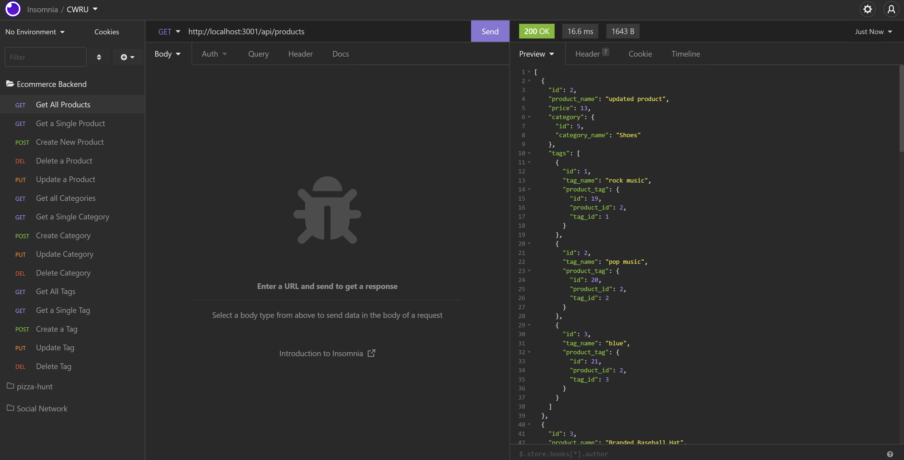

# Ecommerce Backend

This repository contains the source code for the Ecommerce Backend.

## Table of Contents

[description](#description)  
[installation](#installation)  
[usage](#usage)  
[contact](#contact)
[license](#license)

## Description

Ecommerce Backend was created to serve a the front-end of a fictional Ecommerce website. This was a fun project to sink my teeth into and served as a great opportunity to further develop my competency with Express and Sequelize. That said, I feel there's still a lot of room for improvement. I plan to implement my own front-end and refeactor the existing codebase into separate route and controller components.

## How it Works

Three components form the backbone of Ecommerce Product Database;

- The Express.js Routes
- a MySQL database
- The ORM models

Everything starts with the MySQL database, which stores all product data. The data is organized into four tables (Products, Product Tags, Tags, Categories) that are created from Sequelize models. Express routes allow users to perform several types of database operations, including:

- Query, create, update and delete products.
- Query, create, update and delete tags
- Query, create, update and delete categories
- Query, create, update and delete Product Tags

Data is stored, accessed and modified in JSON format. Below are several screen shots illustrating several of these database operations:

## Installation

This is a Node.js application that requires the Express.js and Sequelize.js packages to function.

To install Node.js, follow the instructions provided in the link below.

https://docs.npmjs.com/downloading-and-installing-node-js-and-npm

Once Node.js is installed, the following dependencies can be installed using the Node Package Manager in a CLI:

- Express.js
- Sequelize.js
- MySQL2

## Usage

Given that the database does not currently serve a front-end, functionality must be tested using an API client like Insomnia. Below are links to videos demonstrating the this functionality:

https://drive.google.com/file/d/1ynks2wd_Sl7Q8LQrJFbX84IL3GZBOtfE/view

https://drive.google.com/file/d/1xrRCAs7Cnjt5CZJoQwbN6UU43Ud42ob9/view

## Contributing

Please follow the guidelines below if you wish to contribute to this project.

-Fork the repo on GitHub
-Clone the project to your own machine
-Commit changes to your own branch
-Push your work back up to your fork
-Submit a Pull request so that I can review your changes

## Contact

Find my GitHub profile by following the link below:

https://github.com/rrich-kray/

## License

Copyright (c) 2022, Ryan Kray
All rights reserved.

This source code is licensed under the BSD-style license found in the LICENSE file in the root directory of this source tree and reproduced below.

Redistribution and use in source and binary forms, with or without modification, are permitted provided that the following conditions are met:

1. Redistributions of source code must retain the above copyright notice, this list of conditions and the following disclaimer.
2. Redistributions in binary form must reproduce the above copyright notice, this list of conditions and the following disclaimer in the documentation and/or other materials provided with the distribution.
3. All advertising materials mentioning features or use of this software must display the following acknowledgement: This product includes software developed by Ryan Kray.
4. Neither the name of this application's developer nor the names of its contributors may be used to endorse or promote products derived from this software without specific prior written permission.

THIS SOFTWARE IS PROVIDED BY THE COPYRIGHT HOLDER ''AS IS'' AND ANY EXPRESS OR IMPLIED WARRANTIES, INCLUDING, BUT NOT LIMITED TO, THE IMPLIED WARRANTIES OF MERCHANTABILITY AND FITNESS FOR A PARTICULAR PURPOSE ARE DISCLAIMED. IN NO EVENT SHALL THE COPYRIGHT HOLDER OR CONTRIBUTORS BE LIABLE FOR ANY DIRECT, INDIRECT, INCIDENTAL, SPECIAL, EXEMPLARY, OR CONSEQUENTIAL DAMAGES (INCLUDING, BUT NOT LIMITED TO, PROCUREMENT OF SUBSTITUTE GOODS OR SERVICES; LOSS OF USE, DATA, OR PROFITS; OR BUSINESS INTERRUPTION) HOWEVER CAUSED AND ON ANY THEORY OF LIABILITY, WHETHER IN CONTRACT, STRICT LIABILITY, OR TORT (INCLUDING NEGLIGENCE OR OTHERWISE) ARISING IN ANY WAY OUT OF THE USE OF THIS SOFTWARE, EVEN IF ADVISED OF THE POSSIBILITY OF SUCH DAMAGE.
